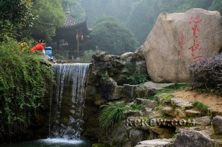
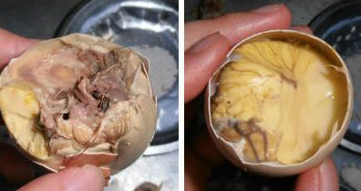

<!DOCTYPE html>
<html lang="en">
<head>
	<meta charset="UTF-8">
	<title>最美兰溪</title>
	<link rel="stylesheet" type="text/css" href="style.css">
	
	
</head>
<body>

	<ul>
		<li class="first selected">首页</li>
		<li>|</li>
		<li class="first">关于兰城</li>
		<li>|</li>
		<li class="first">兰城风光</li>
		<li>|</li>
		<li class="first">十里飘香</li>
	</ul>

	

		<ul class="jpg">
			<li></li>
			<li class="hide"></li>
			<li class="hide"></li>
		</ul>
		<ul class="scroll">
			<li class="color"></li>
			<li></li>
			<li></li>
		</ul>
	

	<pre>	有一座城市名字好美好亮
有一条兰江在她身边静静流淌
点点渔火辉映着璀璨星光
多少古老的传说在水中荡漾
有一座城市名字好美好亮
有一条兰江在她身边静静流淌
点点渔火辉映着璀璨星光
多少古老的传说在水中荡漾
告天台上 把历史细细端详
八卦村里 让古训世代颂扬
芥子园的回廊 还在演绎不朽文章
黄大仙的神奇 已走向那四海五洋
啊 兰溪 兰溪
相约在你的怀抱
啊 中国兰花之乡
我们放声歌唱
有一座城市名字好美好亮
那一条兰江两岸兰花年年开放
座座长虹沐浴着明媚阳光
多少美好的憧憬在风中翱翔
有一座城市名字好美好亮
那一条兰江两岸兰花年年开放
座座长虹沐浴着明媚阳光
多少美好的憧憬在风中翱翔
云山 横山
把宾朋热情拥抱
六洞长河
让游客称奇赞赏
已展现在这片热土上
中洲岛的情侣
又在畅谈精彩人生
新城区的宏图
啊 兰溪 兰溪
啊 兰溪 兰溪
啊 中国兰花之乡
伴着新的世纪
明天更加辉煌
	</pre>

	

		
		
		
	

	

		

			<table>
				<tr class="sureselect2"><td>发展变迁</td></tr>
				<tr><td>历史名人</td></tr>
				<tr><td>乡土人情</td></tr>
			</table>
		

		

			

				
<b>1300年的商业文化积淀的精神</b>

				
就兰溪的开发历史而言，早期兰溪经济的繁荣主要得益于水陆的兴盛。宋室南迁，建都临安（今杭州），江南地区一跃成为全国的政治经济文化中心。而兰溪处“六水之腰”、“七省通衢”，成为贯通浙西皖南以至闽赣的交通枢纽。

				
兰溪人在药材业上拥有绝对优势，其中最著名的要数诸葛家族。诸葛家族的中药行明代就已经走出全国，五口通商之后更是获得迅速发展，据1947年统计，诸葛村人在全国各省、市、县、镇独资或合资经营的中药行店达200多家（而同期全市为350家）.

				
近代以降，随着铁路的兴起，并逐渐替代水运成为这个古老国家的大动脉。在这一轮交通地理的大变革中，水运重镇开始衰落，而新的铁路枢纽城市开始兴起。兰溪繁荣的基础——钱塘江的水运也开始受到冲击

				
同时水利工程兴修带来的水运时代的结束。新中国成立后，开始大规模的水利建设。1957年新安江水库开始修建，兰溪到徽州的水路交通截断。而在历史上，兰溪的繁荣和徽州商人不无关系，徽州商人还为兰溪贡献了难得的商业精神。1968年富春江水库又开始修建，兰溪到杭州水路交通基本结束，成就兰溪1000多年的辉煌水运经济正式结束。

				
机遇同时而来，作为新安江水电站的重点配套项目之一的兰江冶炼厂落户兰溪。在计划经济年代，在这个部属大型国有企业的强力带动下，“浙江铝业”、“凤凰化工”、“兰江味精”、“云山制药”、“兰溪电缆”、“兰溪纺织”、“兰溪机床”等一大批国有企业纷纷建立，兰溪成功地从一个商贸港口转型为工业重镇

				
<b>商业精神的丧失</b>

				
国有大企业和计划经济体制的确立，结果之一就是对兰溪文化精神的重新塑造。吃苦耐劳，敢于挑战的商人被改造成国有企业循规蹈矩的厂长经理，精明能干、细心谨慎的伙计成了安逸享受的员工。于是积极进取的商业冒险精神为按步就班的官僚文化和安逸享受的市民文化所代替

				
接踵而至的是经济的衰退，习惯了计划经济体制下国有企业安逸生活的兰溪人，已经失去了在商业文化中游泳的勇气和能力。

				
兰溪人不缺乏文化基础，改变兰溪的命运，从我们做起

			

			

				
<b>贯休</b>

				
俗姓姜，字德隐，浙江省兰溪市游埠镇仰天田人，唐末五代著名画僧。7岁时投兰溪和安寺圆贞禅师出家为童侍。贯休记忆力特好，日诵《法华经》1000字，过目不忘。贯休雅好吟诗，常与僧处默隔篱论诗，或吟寻偶对，或彼此唱和，见者无不惊异。贯休受戒以后，诗名日隆，仍至于远近闻名。

				
<b>张志和</b>

				
字子同，初名龟龄，汉族，自号“烟波钓徒”，又号“玄真子”。唐代著名道士、词人和诗人。十六岁参加科举，以明经擢第，授左金吾卫录事参军，唐肃宗赐名为“志和”。因事获罪贬南浦尉，不久赦还。自此看破红尘，浪迹江湖，隐居祁门赤山镇。其兄张鹤龄担心他遁世不归，在越州（今绍兴）城东筑茅屋让他居住。史载唐肃宗曾赐他奴婢各一人，张志和让他们结婚，取名渔童和樵青。著有《玄真子》集。最为人所知的作品：《渔歌子·西塞山前白鹭飞》。

				
<b>李渔</b>

				
初名仙侣，后改名渔，字谪凡，号笠翁。籍贯兰溪市夏李村。明末清初文学家、戏曲家。18岁补博士弟子员，在明代中过秀才，入清后无意仕进，从事著述和指导戏剧演出。后居于南京，把居所命名为“芥子园”，并开设书铺，编刻图籍，广交达官贵人、文坛名流。著有《凰求凤》、《玉搔头》等戏剧，《肉蒲团》、《觉世名言十二楼》、《无声戏》、《连城壁》等小说，与《闲情偶寄》等书

				
<b>曹聚仁</b>

				
浙江兰溪人，民国著名记者、作家。毕业于浙江第一师范。1922年到上海，任教于爱国女中、暨南大学、复旦大学等校。曾主编《涛声》、《芒种》等杂志。抗日战争爆发后，任战地记者，曾报道淞沪战役、台儿庄之捷。1950年赴香港，任新加坡《南洋商报》驻港特派记者。50年代后期，主办《循环日报》、《正午报》等报纸。后多次回内地，促进祖国统一事业。著有《中国学术思想史随笔》、《万里行记》、《现代中国通鉴》等。

			

			

				
<b>【斗牛】</b>

				
兰溪斗牛的始源说法不一。“相传三国时吴卢植为娱妻而设。”或曰“斗牛始于宋明道（1032－1033）年间。”兰溪北乡斗牛相沿成习，这里农牧业发达，加上北乡劳动人民坚毅智勇，故以斗牛为内容的体育娱乐为他们所喜爱

				
<b>【婚嫁习俗】</b>

				
兰溪各地男婚女嫁习俗大同小异繁简不一，贫富有别。建国前，主要经过定亲、起节、搬奁、迎娶、婚礼、洞房、三朝、双回门、满月等，过程颇为繁杂。建国后，废除封建买卖婚姻，提倡自由恋爱，婚姻自主，提倡节约办婚事，尚有参加集体结婚和旅游结婚

				
<b>【丧葬习俗】</b>

				
兰溪老人死亡称"过辈"，丧葬以衣衾棺椁，修坟树碑。葬礼以死者家族地位定繁简，一般都要经过送终、落地、报丧、入殓、封材、开吊、做道场、点主、出殡、安葬、谢孝等礼俗。人死后要"烧六七"，自"一七"至"六七"终丧，孝子过了"六七"才可理发。死后二年内的春节贴蓝纸白字或黑字门联和柱联。

				
<b>【贺生庆寿礼俗】</b>

				
兰溪贺生礼俗有催生、报生(女婴一般报生)、三朝、满月、百日、周岁等，还有"认亲爹亲娘"、"认樟树娘"之俗。每年生日"过关"至16岁。年龄到五十岁开始庆寿，十年一庆，有男庆九、女庆十之分。平民庆寿只由出嫁女儿送寿礼先祭拜天地与先祖，后受晚辈祝贺，礼毕吃寿面，俗称长寿面。富有之家先发贴，设寿堂、行寿礼、摆寿宴等。人死后有庆阴寿，亦十年一庆，至百岁止。

				
<b>【建房·分家礼俗】</b>

				
造新房要择吉日良辰，实地定向，挖脚奠基，立柱上栋之日贺客盈门，中柱贴"竖柱喜逢黄道日，上梁巧遇紫微星"，横批"吉星高照"，晚上设宴庆贺。建国后，此俗简化。兄弟分家要请娘舅主持，先定好赡养父母办法，后分割财产，写好分家书，父亲、兄弟和中人画押签字，各户砌好灶，从老灶引火点燃新灶柴禾，象征祖宗福祥兄弟均沿。

			

		

		

	

	

		
		
		
	

	

		
		
<b>诸葛八卦村</b>

		
诸葛八卦村原来叫高隆村，位于浙江省金华市兰溪市西部，是迄今发现的诸葛亮后裔的最大聚居地。村中建筑格局按“八阵图”样式布列，且保存了大量明清古民居，是国内仅有、举世无双的古文化村落。

		
诸葛八卦村一带地形如锅底，中间低平，四周渐高。四方来水，汇聚锅底，形成一口池塘，这就是钟池。钟池是诸葛八卦村的核心所在，也是布列“八阵图”的基点。钟池并不大，但这口水塘半边有水，半边为陆，形如九宫八卦图中的太极，奇妙无比。以钟池为中心，有八条小巷向四面八方延伸，直通村外八座高高的土岗，其平面酷似八卦图。小巷又派生出许许多多横向环连的窄弄堂，弄堂之间千门万户，星罗棋布着许多古老纵横的民居。接近钟池的小巷较为笔直，往外延伸时渐趋曲折，而许多小巷纵横相连，似通非通，犹如迷宫一般。外人进入小巷，往往好进难出，甚至迷失方向。有意思的是，数百年来村中居住的诸葛亮后裔并没有意识到小村布局的奇妙之处，身在“八阵图”，不知八卦形。直到从一本旧书中查到相关记载，这一奥秘才大白于天下。如今，只要登上镇外的土岗向下俯视，仔细辨别，整个村落九宫八卦之形就会完整地展现在眼前，其布局之奇妙独特，令人赞叹不已。1993年，国家文物局专家组组长、著名古建筑学家罗哲文先生实地考察诸葛镇后说，中国传统的村落和城郭布局有依山傍水的不规则形和中轴对称的方整形两种，像诸葛镇这种围绕一个中心呈放射状的九宫八卦形布局，在中国古建筑史上尚属孤例，其重大价值不言而喻。

		
诸葛镇为何如此布局，迄今说法不一。有人认为这种布局是诸葛亮“八阵图”的翻版，是诸葛后人根据诸葛亮阵法精髓而设计的，这既是对祖先的一种特殊纪念，也是对诸葛亮“八阵图”的变相保存；诸葛后人虽然不嗜争强斗狠，但战备意识很强。如此布局，有利于在钟池一呼百应，从四面八方包围来犯之敌，无形中增大了取胜的把握。如此等等，见仁见智，不一而足。也许，随着新资料的不断发现，这个问题在不久的将来就可完全解开。

		<input type="button" name="return" value="返回">
	

	

		
		
<b>地下长河</b>

		
涌雪洞中一条长逾千米的地下暗河贯穿始终，源头至今尚未探明，洞内气温常年保持18度，冬暖夏凉，舟行其中，宛若置身仙境。玉露洞天高大空旷，厅内精美的石钟乳、石笋、石幔琳琅满目，美不胜收。“时间隧道”中景石奇幻、近在咫尺，具有很高的观赏和科研价值。 六洞山风景名胜区古迹颇多，幽静雅致的绮霞园为一代名媛、爱国将领张学良夫人赵四小姐的祖居地。千年古刹栖真寺内曾珍藏《大藏经》6000多卷，系唐僧“西天”取来经卷的译本，是研究我国古代文化的宝贵资料。充满传奇色彩的皇回禅寺叙说了明代皇帝叔侄相残，致使惠帝朱允出走为僧，最后埋骨于此的故事...... 

		
地下长河现已开发1043米，分涌雪洞、时间隧道、玉露洞三段游程，其中800米左右可以乘船揽胜，旱路长达2500米，浏览面积为20000平方米。洞口一泓碧波荡漾的..... 进入第二层--时间隧道。这一段路程中到处可见在第四世纪上更新世温热期由汽凝水在洞壁上生长的珊瑚状、鹿角状、针状石花..... 穿行在时间隧道中，兜兜转转不知东南西北，顺着这“指点迷津”的手指断续前行，眼前豁然开朗，来到玉露洞天。..... 山脚下洞源村依山傍水，地灵人杰，孕育一代名媛赵四小姐一一张学良将军夫人。赵四闺名绮霞，因此，村中祖居所在称“绮霞园”..... 出玉露洞，往景区另一端行千米左右，可以到达一处新近开发的景点--紫霞洞。紫霞洞俗称燥洞，又名中洞、予牙洞..... 沿山腰小道上行数百米，便到了栖真寺。数峰环峙、满目苍翠寺前有天池泉，寺后有龙穴泉，寺侧有小飞来峰.....

		<input type="button" name="return" value="返回">
	

	

		
		
<b>兰荫山</b>

		
兰荫山风景名胜区位于兰溪市城区西南，由兰荫山、革命烈士纪念地、芥子园三大部分组成，面积2．86平方公里

		
兰荫山海拔140米，因古时盛产兰花而得名，其横截江流，形似苍龙，又名横山。登山远眺，南向田畴坦荡，云树烟村；北顾丘陵起伏，远接天际；俯视则三江襟带，千帆竞发。入夜，中洲渔火，烛光倒影，美不胜收。西侧为兰荫寺，始建于元代。寺前有摩崖石刻“兰荫深处”四字，署“正德十四年桂月十五御题”。“兰荫春葫”为兰溪八景之一。其前有工人休养院，院内环境幽雅，绿树成荫，楼、台、亭、树别具一格。南端山脊有耸入云端的“聚利塔”，九层八面，内设旋梯，拾级于顶层，纵目四顾，城乡风光尽收眼底。临江山巅有迎仙门、仙坛、神龟岩等景点，东麓有灵源积庆侯庙，俗名横山殿，始建于刘宋泰始二年，清同治六年重建，正德《兰溪县志》即在此庙编纂，1985年列为兰溪市重点文物保护单位。

		
兰荫山的东北面筑有兰溪革命烈士纪念碑和纪念馆，是兰溪市爱国主义教育基地之一，也是全市唯一的革命烈士纪念地。兰荫山的东麓建有清代戏剧理论家、戏剧家和小说家李渔纪念地——芥子园。开放以来，先后有日、法、德、韩等十几个国家和地区的专家学者前来考察，已日渐成为人们和来兰旅游瞻仰李渔的必到之处。

		<input type="button" name="return" value="返回">
	

	

		<ul>
			<li class="sureselect3">小萝卜</li>
			<li>肉圆</li>
			<li>鸡子粿</li>
			<li>汤圆</li>
			<li>凤凰蛋</li>
			<li>酥饼</li>
		</ul>
	

	

	

		
		
		
		
		
		
	

	

		
兰溪小萝卜，原产地在兰溪云山街道黄湓村、十里亭村、陈店村、盛道院村一带，距今有近千年种植历史。兰溪小萝卜主要利用晚稻收割后的秋冬季节生产，种植面积近3万亩，年产值5000多万元；加工后的兰溪小萝卜以其个小、色白、脆嫩、味美等特点赢得市场的青睐，年生产加工两万多吨，加工产值8000多万元。2005年3月通过“原产地标记注册”登记。兰溪小萝卜特点：营养价值高，含有大量的糖类、多种维生素、碳水化合物、粗纤维及蛋白质等，民间素有萝卜赛人参之说；个小，一斤小萝卜有17-25个；体白，经过腌制后口感脆嫩；是老少皆宜的食品。

		
兰溪肉圆是一种地方风味小吃，可当主食也可当菜肴，是兰溪当地待客的一道主菜

		
鸡子粿是浙江兰溪地区特有的一种美食，带常作为兰溪人的早饭或者午后点心。皮薄香脆馅足多汁。过去在一些流动戏场里都有摊点售卖，现在在兰溪已经开起了鸡子粿的店。成为了古城兰溪特有的文化符号。鸡子粿老少皆宜营养丰富
		 鸡子粿选用优质的小麦粉加少许食盐增加韧性用温水和面擀出适当厚度的面皮，把五花肉或者瘦肉剁丁，把自制的比较老的豆腐剁丁，把鸡蛋打在小碗里加适量的葱花料酒酱油搅拌。把肉丁豆腐丁包入面皮在粿的一面留一个小口，把粿放入盛有少量菜油的平底锅里煎至6分熟，用筷子撑开预留的小口把搅拌好的鸡蛋灌入粿中，这是蛋液会渗透进肉丁和豆腐的缝隙里实现美味的融合。再正反都煎至金黄出锅，美味的鸡子粿就诞生了。
		 可当早餐食用配上一晚粥也可以当作下午点心配上一晚馄饨，美味营养丰富。

		
兰溪汤头，也叫汤圆，米腂，是一种咸汤圆，其造型有着独特的尖尖头。皮薄馅多，口味更适合现代人。
		而关于兰溪汤头，还有一个故事。古时兰溪有个秀才，特别喜欢吃妻子做的汤头。秀才与妻子相当恩爱，彼此有两枚珠子，为定情信物。秀才进京赶考，得了次第，被宰相招女婿时选中。宰相女儿贤良淑德，通情达理，秀才渐渐忘了自己的结发妻子。此时，妻子也来到京城寻找自己的结发夫婿。而秀才也怀念起兰溪汤头，每天食欲不振，吃什么都想起兰溪汤头，因为府里的厨娘不会烧兰溪汤头，于是府里就招厨娘，指明会做兰溪汤头。妻子经过多方打听，也终于知道自己的结发夫婿成了宰相的女婿。看到宰相府里招厨娘，于是她就去了。秀才吃到了兰溪汤头，但没想到竟然在汤头里面吃到了一颗珠子，他立刻明白是自己的发妻做的，想到以前的种种，他顿时泪如雨下。于是宰相女儿就询问原因，他如实回答。此事后，夫妻相认，但由于秀才已为宰相女婿，不得已，原配妻子回到兰溪。

		
据说，兰溪民间吃凤凰蛋的习俗和乾隆皇帝有关。乾隆皇帝下江南来到兰溪一带和随从走散了，他一个人走得又饿又乏，路旁一个农家歇脚讨东西充饥。农妇家贫得没别的东西，就把鸡窝里正在孵的几个鸡蛋拿出来煮给他吃了。没想到，乾隆越吃越觉好吃，，吃后力气大增。因孵鸡蛋里的雏鸡已经成形或半成形，古人又把鸡称为凤凰，故而乾隆赐名“凤凰蛋”。凤凰蛋炕孵时间约为十几天，掌握鸡蛋里的雏鸡欲出非出时即行。凤凰蛋的烹饪制作也较为简便，先将凤凰蛋清洗，然后放入适量的水，以及盐、酱油、料酒，煮沸后即可食用。凤凰蛋具有较高的营养价值，含有丰富的蛋白质，素有“常吃凤凰蛋，胜补钙中钙”之赞誉。凤凰蛋不仅具有健胃功能，而且可以延年抗衰，是保健的上佳补品，据说还是治头痛的偏方呢凤凰蛋的吃法颇有讲究。首先，将煮熟后的凤凰蛋“咔”一下磕开一个口子，香味立刻扑鼻而来，然后撕开蛋膜，撒上少许椒盐溶入汤汁之中，这样可以除去蛋中腥味，用嘴轻轻一吸，啊，顿觉满口生津，鲜美的汤汁在口腔内吸引了所有味觉细胞，美妙至极，不忍下咽……斯文的食客会用竹签一插一拔，就把隐隐约约能看到雏形的凤凰蛋整个儿从蛋壳中拔出，蘸着醋或椒盐香喷喷地一口一个，记住喽，最好闭上眼睛，一口一个哦！

		
兰溪酥饼圆若茶杯口，形似蟹壳，底部平整，外形丰满，面带芝麻，两面金黄，色泽淡雅，入口酥、脆，加上芝麻和霉干菜独特的香味，具有特殊风味，是名扬四海的传统美食。
       兰溪酥饼历史久远，据相关资料推算，至今已有一千多年历史。目前，金华酥饼制作技艺已被列入浙江省级非物质文化遗产名录，其中金华市大麻子食品连锁有限公司总经理潘跃林是该项目的省级代表性传承人。
       传统的兰溪酥饼选取精面粉、白砂糖、食用植物油、肥猪肉、上等干菜、食用盐、芝麻等，用炭火烘烤而成。其制作流程是：先把面粉和匀、揉透，每摊平一次涂上菜油、撒上干面粉，反复几十次，使面团既韧又软，做成千层饼，内装干菜、肉等馅，再撒上芝麻，用炭火烘熟烤脆。传统的酥饼是放在炉里子烘烤，如今通过机器加工制作，现代化流水线生产，一千多年的发展，酥饼依然是人们心目中经久不衰的传统美食。
       兰溪酥饼是一项传承状况比较好的非遗项目，城乡各地都有人制作，其中名气较大的有大麻子酥饼、聋庞酥饼、雨台酥饼等。游埠为千年古镇，旧时沿衢江有多个码头，游埠酥饼在清末民国初期就有自己的品牌，名气在外。以前在农村小酒店里，酥饼就是一道下酒佳肴，人们喝着老酒，嚼着几只酥饼，美不可言。

	

	

designed by wxf

</body>
</html>
